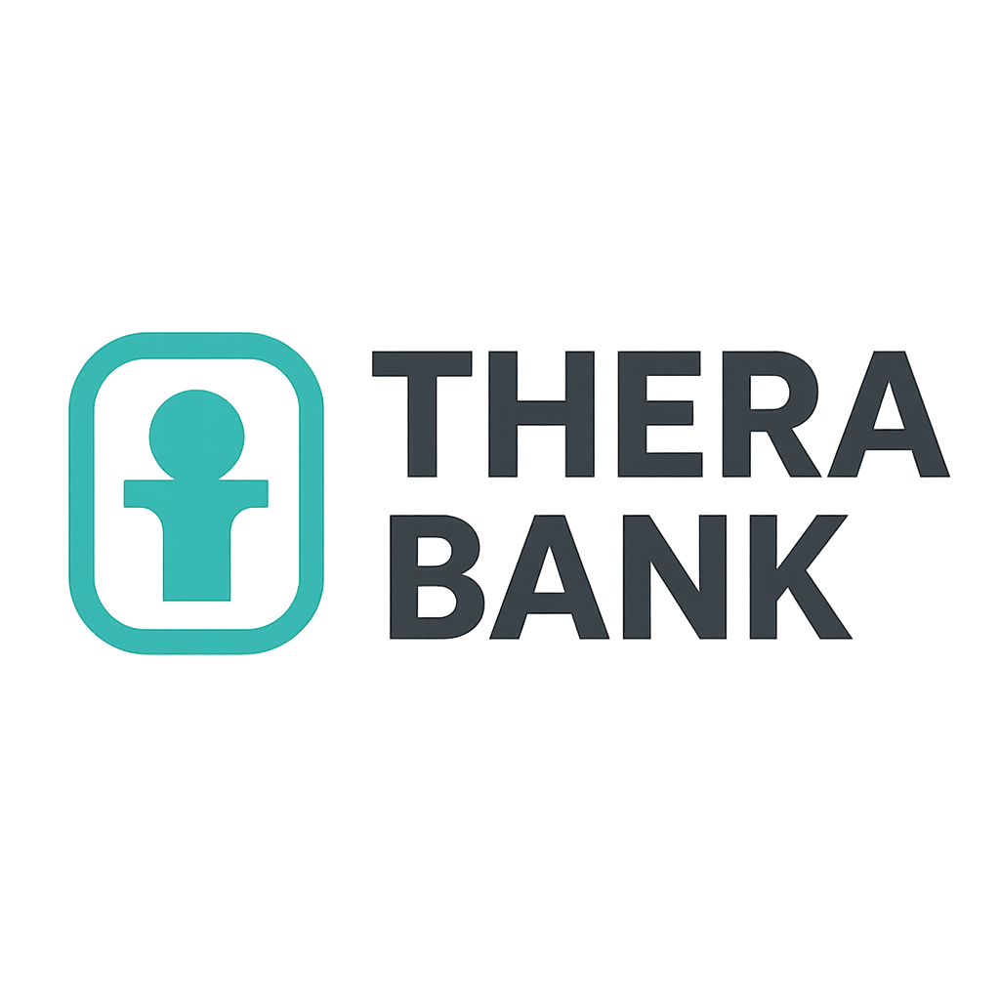

  
  

Este conjunto de dados refere-se a um banco (Thera Bank) cuja administração pretende explorar formas de converter os seus clientes passivos em clientes de empréstimos pessoais (mantendo-os como depositantes). Uma campanha que o banco realizou no ano passado para clientes passivos mostrou uma taxa de conversão saudável de mais de 9% de sucesso. Isso encorajou o departamento de marketing de varejo a elaborar campanhas com melhor marketing direcionado para aumentar a taxa de sucesso com um orçamento mínimo.

### Projeto de conclusão de curso ADATech - Estatística1

 Base de dados 
[Bank personal loan](https://www.kaggle.com/datasets/ahmadrafiee/bank-personal-loan/data)